# Paper Theme
The original way to read.

## Introduction & Philosophy
*Paper* is an extremely legible, light colour palette “based on the colour of paper as found in various notebooks,” and originally created by [Yorick Peterse](https://gitlab.com/yorickpeterse). As a result, *Paper* is [healthier for our eyes](https://ux.stackexchange.com/questions/53264/dark-or-white-color-theme-is-better-for-the-eyes), making it the optimal choice for long-term viewing and a necessity in digital life.

Keeping to the [minimalist spirit of the original](https://gitlab.com/yorickpeterse/vim-paper) `vim` plugin, only the most essential information is differentiated with colour. By using fewer colours reminiscent of a multi-pen, only the important is clearly identified, further enhancing *Paper’s* legibility in many applications.

Please note that the palette has been designed with the following display properties in mind:

- An LCD/TFT display
- A display temperature range of 4000K-5200K
- A low display brightness

## Supported Applications
To submit application requests please raise an issue or feel free to contribute via a pull request. Cheers!

### Browsers
- **Chrome**
    - Available as an [extension on the Chrome Store](https://chrome.google.com/webstore/detail/paper-theme/pmfelkdbnoadbaioappibdfakfdfhlle).
    - 

        
Screenshot

        

            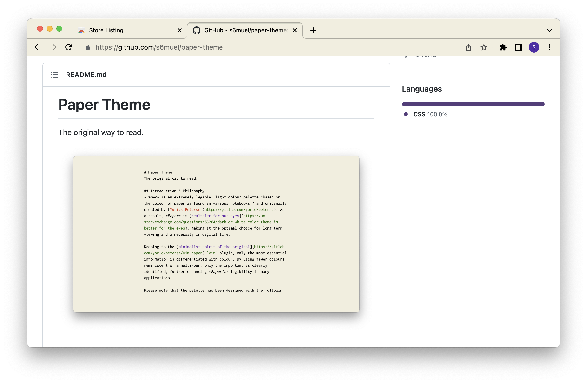</img>
        

    

- **Firefox**
    - Available as an [add on from Mozilla](https://addons.mozilla.org/en-US/firefox/addon/legible-paper-theme/).
    - 

        
Screenshots

        

            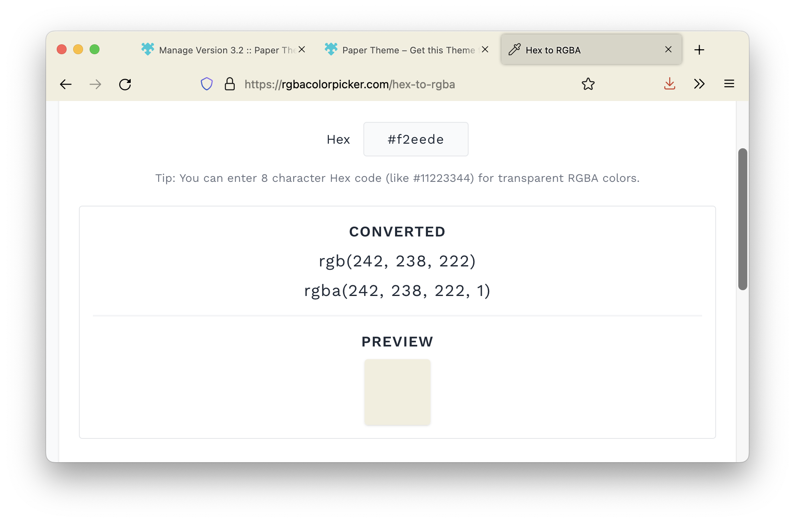</img>  
            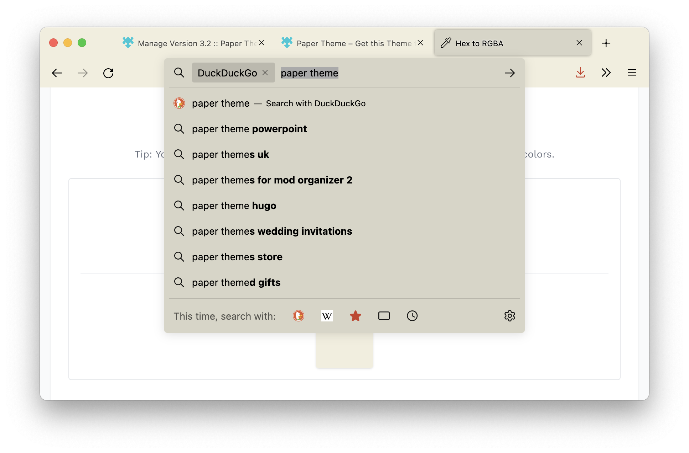</img>
        

    

- **Vieb** (It’s pronounced ‘veep’ like ‘sheep’) -- [[Source]](themes/vieb)
    - Includes default and compact layouts; and follow-mode hinting colours reminiscent of traditional highlighters.
    - 

        
Screenshots

        

            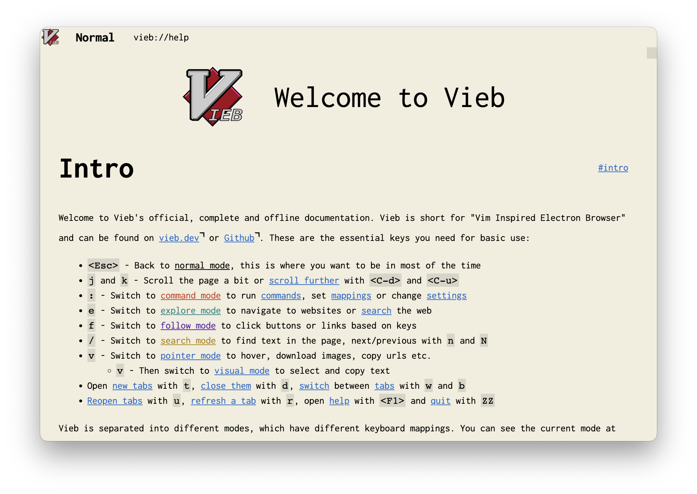</img>  
        

    

### File Managers
File manager palettes are applied in line with `exa`’s [File Class Colours](https://the.exa.website/docs/colour-themes).

- **Midnight Commander**
    - Installation
        1. Download the latest release **[here](https://gitlab.com/samue1/paper-theme/-/raw/main/themes/mc/paper-true.ini)** and place it in your `~/.local/share/mc/skins` folder
            - You may need to create this folder: `mkdir -p ~/.local/share/mc/skins`
        2. Run `mc`; press `F9`, then `oa`, and select `paper-true` as your skin
        3. Remove your sunglasses (or don't 😎)
    - 

        
Screenshots

        

            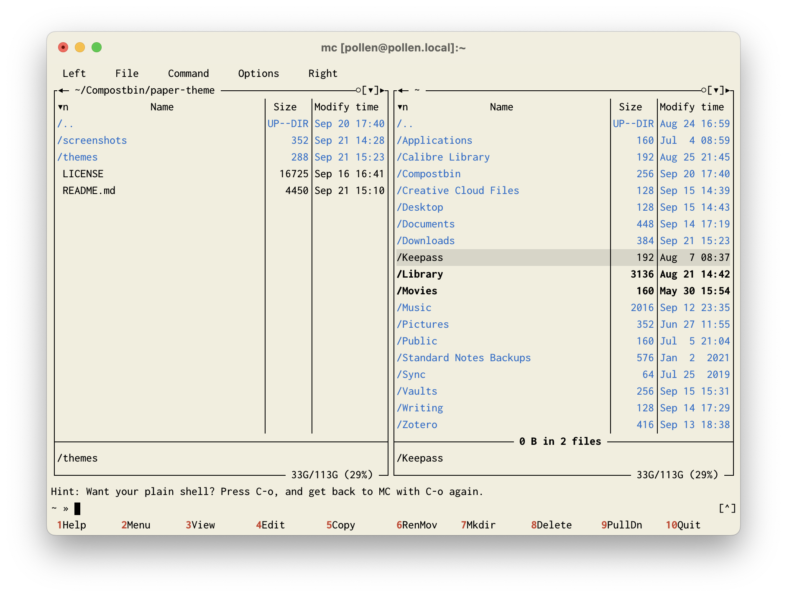</img>  
            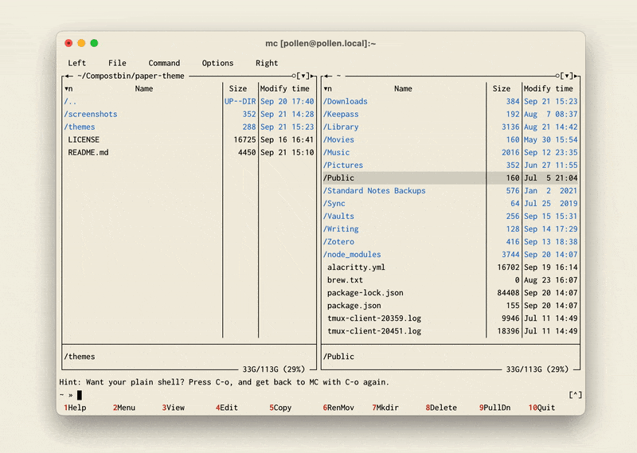</img>
        

    

- **vifm**
    - Available via the [vifm-colors repository](https://github.com/vifm/vifm-colors/).
    - 

        
Screenshot

        

            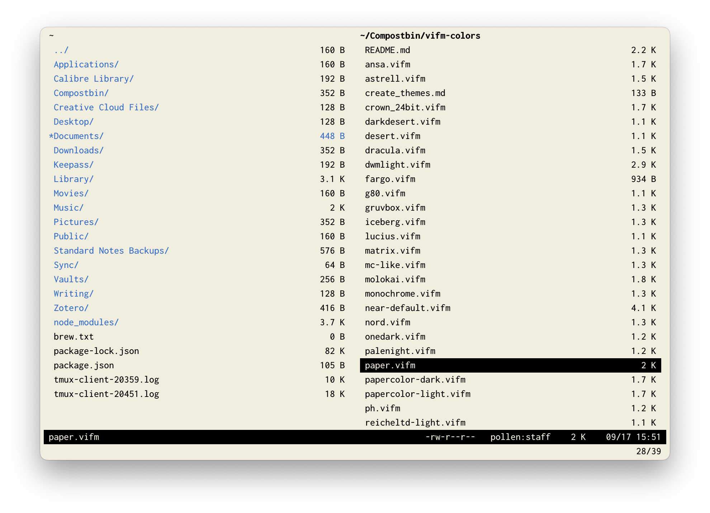</img>
        

    

### Resource Monitors
- **Bashtop**
    - Installation
        1. Download the latest release **[here](https://gitlab.com/samue1/paper-theme/-/raw/main/themes/bashtop/paper.theme)** and place it in your `~/.config/btop/themes` folder
            - You may need to create this folder: `mkdir -p ~/.config/btop/themes`
        2. Run `btop`, press `Esc`, open ‘Options’, and select `paper` as your theme
        3. Consider a lower SPF sun cream 🏖️
    - 

        
Screenshot

        

             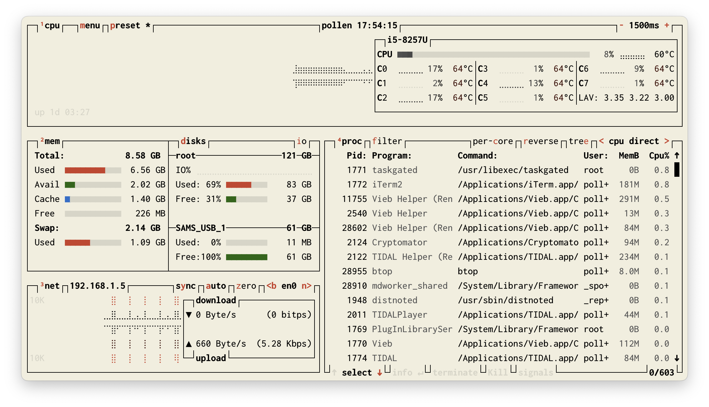</img>
        

     

### Terminals
- **Alacritty**
    - Available with the [alacritty-themes](https://github.com/rajasegar/alacritty-themes) extension.
    - 

        
Screenshot

        

             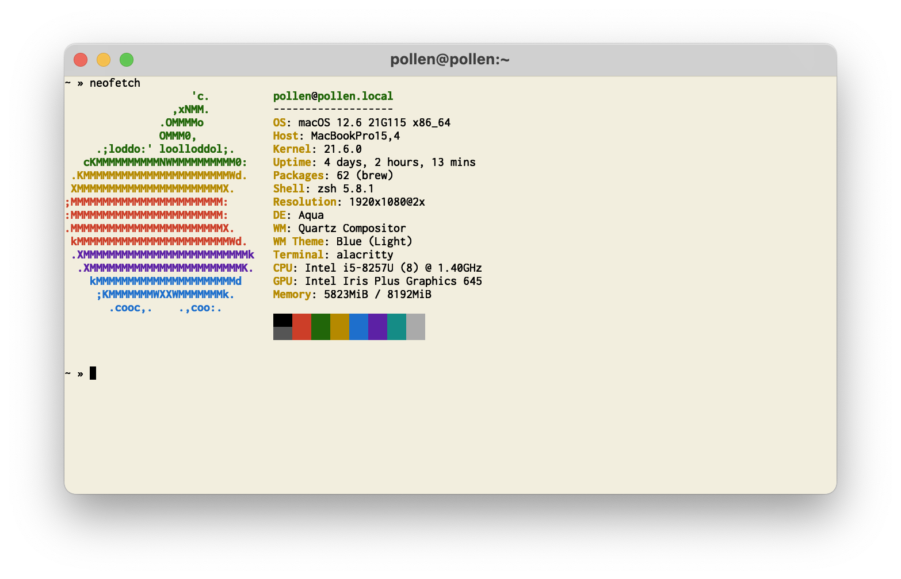</img>
        

     

- **Hyper**
    - Available via [npm](https://www.npmjs.com/package/hyper-paper): simply run `hyper i hyper-paper` inside Hyper.
    - 

        
Screenshot

        

             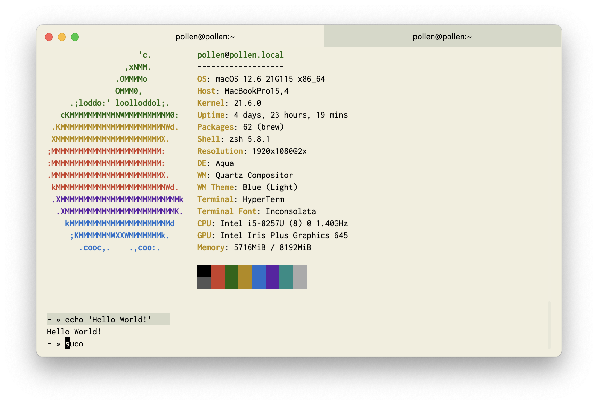</img>
        

     

- **iTerm2**
    - Installation
        1. Download the latest release **[here](https://gitlab.com/samue1/paper-theme/-/raw/main/themes/iterm/paper.itermcolors)**
        2. Run `iTerm2`, press `⌘,`, open ‘Profiles’ and select the ‘Colors’ tab
        3. Click the ‘Color Presets’ drop-down, click ‘Import’ and select the `paper.itermcolors` file
        4. Select ‘Paper’ from the ‘Color Presets’ drop-down
        5. Seek out the sun elsewhere ☀️
    - 

        
Screenshot

        

             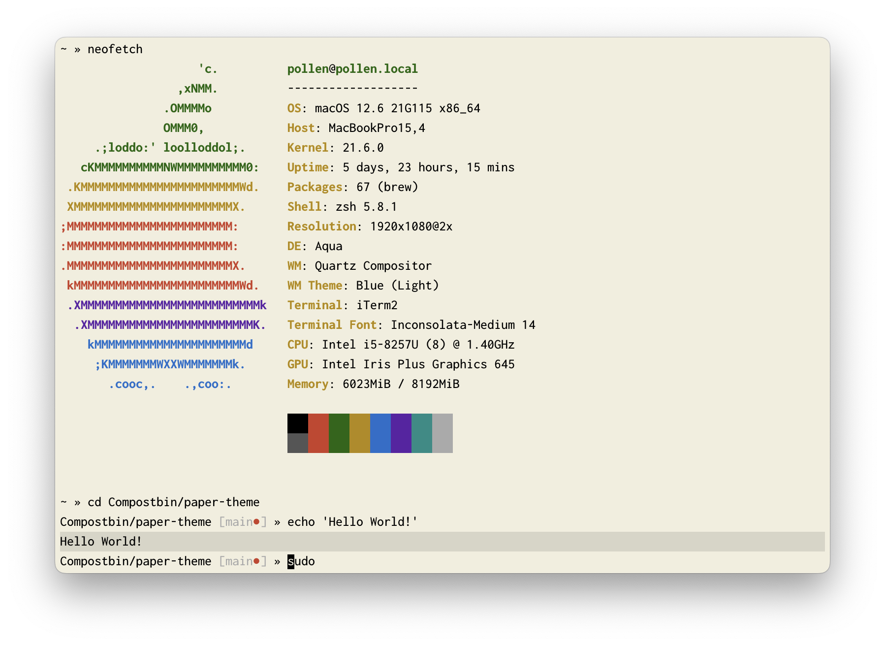</img>
        

     

- **Tilix**
    - Installation
        1. Execute the following command to download the theme:
            - `wget -qO $HOME"/.config/tilix/schemes/paper.json" https://gitlab.com/samue1/paper-theme/-/raw/main/themes/tilix/paper.json`
        2. Open `Tilix` and select ‘Paper Theme’ via `Preferences -> Default -> Color -> Color scheme`
        3. Enjoy!
### Text Editors
- **Obsidian**
    - Installation
        1. Download the latest release **[here](https://gitlab.com/samue1/paper-theme/-/raw/main/themes/obsidian/paper-theme.json)**
        2. Install the latest version of:
            - @kepano’s [Minimal Theme](https://github.com/kepano/obsidian-minimal) and [Minimal Theme Settings plug in](https://github.com/kepano/obsidian-minimal-settings)
            - @mgmeyers’ [Style Settings plug in](https://github.com/mgmeyers/obsidian-style-settings)
        3. Open `Style Settings` and import `paper-theme.json`
        4. Enjoy!
    - 

        
Screenshots

        

             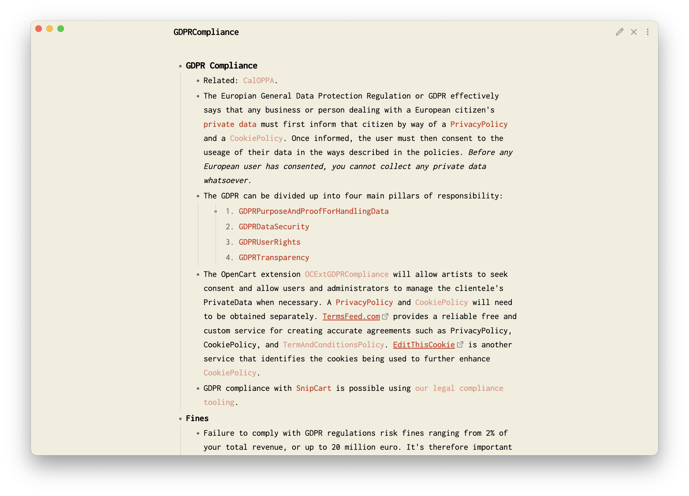</img> 
             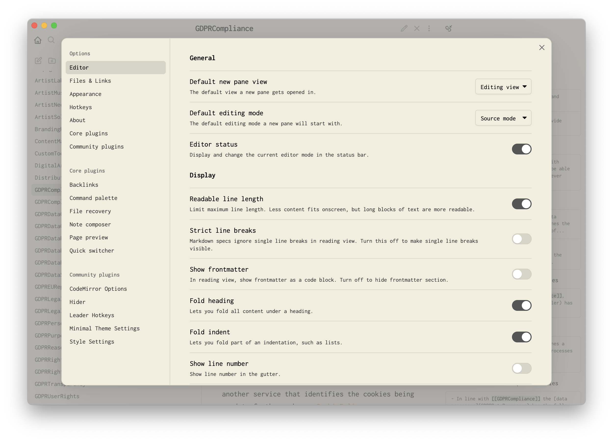</img>
        

     

- **(Neo)Vim**
    - *The* ***original*** [Paper Theme plug-in](https://gitlab.com/yorickpeterse/vim-paper) c/o @YorickPeterse.
    - 

        
Screenshot

        

             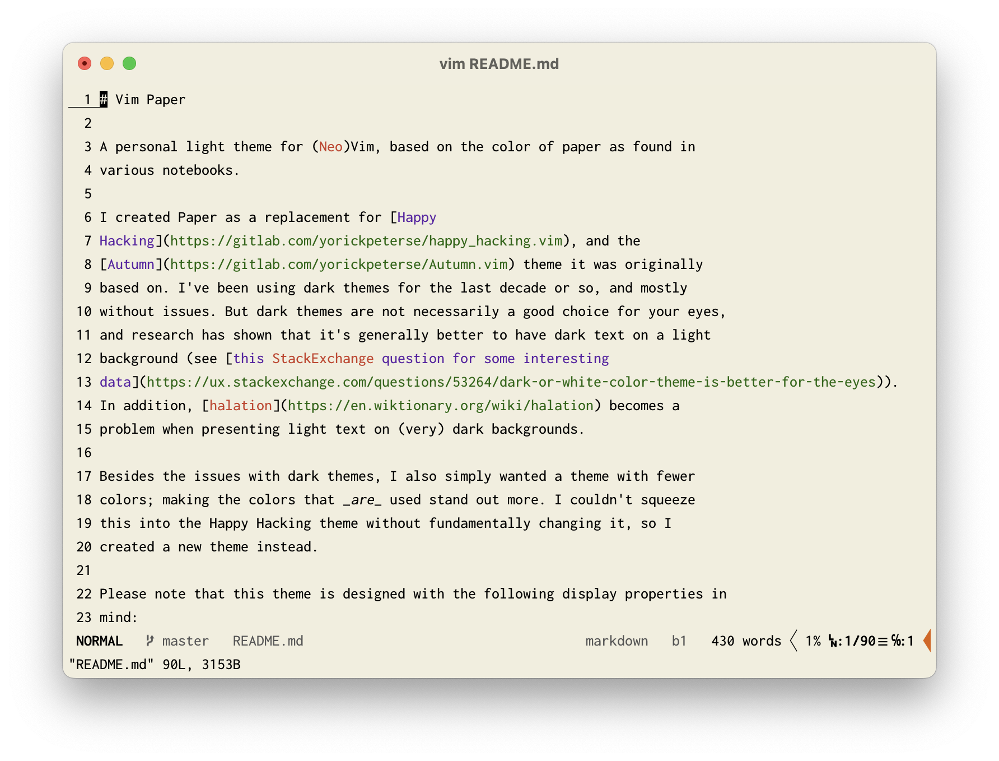</img>
        

     

- **Visual Studio Code**
    - Install via [VS Marketplace](https://marketplace.visualstudio.com/items?itemName=18kimn.notebook-theme) c/o @18kimn (Nathan Kim).

## The Palette

| Color   | Normal    | Bright    | GNOME Terminal color index
|:--------|:----------|:----------|:--------------------------
| Black   | `#000000` | `#555555` | 0, 8
| Red     | `#CC3E28` | `#CC3E28` | 1, 9
| Green   | `#216609` | `#216609` | 2, 10
| Yellow  | `#B58900` | `#B58900` | 3, 11
| Blue    | `#1E6FCC` | `#1E6FCC` | 4, 12
| Purple  | `#5C21A5` | `#5C21A5` | 5, 13
| Cyan    | `#158c86` | `#158c86` | 6, 14
| White   | `#AAAAAA` | `#AAAAAA` | 7, 15

For the text color, highlight color, etc, use:

| Color     | Foreground | Background
|:----------|:-----------|:------------
| Text      | `#000000`  | `#F2EEDE`
| Highlight | `#000000`  | `#D8D5C7`

## Thanks
- This project would not be possible without [Yorick’s](https://gitlab.com/yorickpeterse) work -- cheers mate!
- The [Dracula project](https://github.com/dracula) has provided useful starting places for the Chrome, Firefox, and Tilix themes.
- Tilix’ installation instructions were sourced from the [Tilix-Themes](https://github.com/storm119/Tilix-Themes) project c/o @storm119.
- The light theme from the `vim-airline-themes` originally written in [July, 2013](https://github.com/vim-airline/vim-airline-themes/commit/72a201e61882b907df355432e313d34c6e949396) by @bling, provided the base for `paper.vim`.

## License
All source code in this repository is licensed under the Mozilla Public License version 2.0, unless stated otherwise. A copy of this license can be found in the file "LICENSE".
